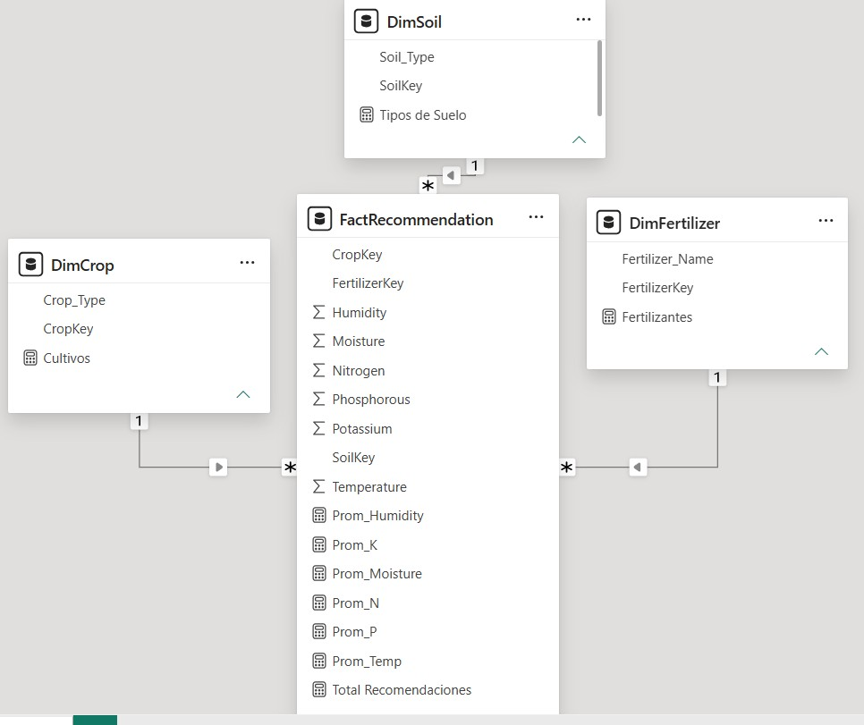
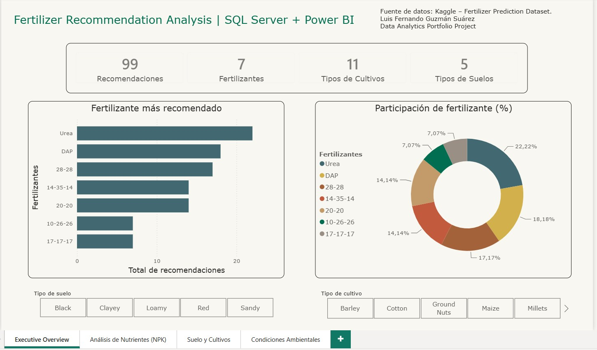
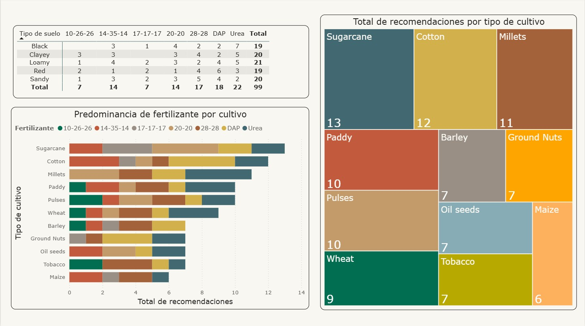
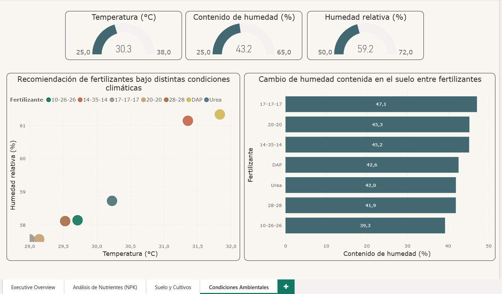

# Fertilizer-recommendation-analysis

# 📊 Dashboard de Análisis de recomendaciones de fertilización - Power BI

## Resumen

Este proyecto analiza las recomendaciones de fertilización considerando las condiciones ambientales, los tipos de suelo, los tipos de cultivo y la composición de nutrientes (NPK).

El objetivo era desarrollar una solución analítica completa utilizando SQL Server y Power BI.

---

## Conjunto de datos

Fuente: Kaggle - Conjunto de datos de predicción de fertilizantes

Variables analizadas:

- Temperatura
- Humedad
- Humedad del suelo
- Tipo de suelo
- Tipo de cultivo
- Nitrógeno
- Fósforo
- Potasio
- Recomendación de fertilizante

---

## Herramientas utilizadas

- SQL Server
- Power BI
- DAX
- Modelado de datos

---

## Modelado de datos

Se implementó un modelo de esquema de estrella:

- FactRecommendation
- DimSoil
- DimCrop
- DimFertilizer

---

## Desafíos encontrados

Durante el proceso de modelado dimensional, se identificó un problema: la presencia de registros duplicados en las tablas de dimensiones generaba un efecto de multiplicación de filas al crear la tabla de hechos.

El problema se resolvió reconstruyendo las dimensiones con valores DISTINCT para cada dimension.

---

## Páginas del panel de control

### Resumen ejecutivo
- Recomendaciones totales
- Distribución de fertilizantes
- Filtros de suelo y cultivo

### Análisis NPK

- Análisis de nitrógeno
- Análisis de fósforo
- Análisis de potasio

.jpg)

### Análisis de suelo y cultivo
- Recomendaciones de fertilizantes por cultivo
- Recomendaciones de fertilizantes por Suelo

### Condiciones ambientales

- Análisis de temperatura
- Análisis de humedad
- Análisis de humedad del suelo
  

---

## Principales hallazgos

- La urea fue uno de los fertilizantes más recomendados.
- Los perfiles de nutrientes varían significativamente entre los diferentes tipos de fertilizantes.
- El tipo de suelo influye en las recomendaciones de fertilización.
- Las condiciones ambientales afectan la selección de fertilizantes.

---

## Autor

Luis Fernando Guzmán Suárez
DATA ANALYST | EXCEL | POWER BI | SQL | Estadística aplicada | Lean Six Sigma Yellow Belt
